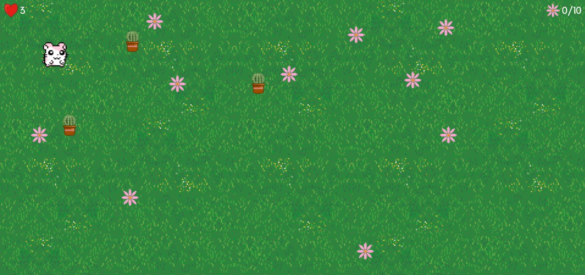

# Flower Adventure Game
## Description
Flower Adventure Game is a fun and engaging browser-based 2D game where the player controls a character to collect flowers scattered across a field while avoiding cacti. The player starts with three lives and must collect all ten flowers to win the game. If the character touches a cactus, they lose one life. The game is over if the player loses all lives.

## Instructions

Use the arrow keys to move the character:
- Up: `Arrow Up`
- Down: `Arrow Down`
- Left: `Arrow Left`
- Right: `Arrow Right`
- Collect all 10 flowers to win the game.
- Avoid touching the cacti to preserve lives.
- The game ends if all lives are lost.

Winning the game redirects to the `youwin.html` page. Losing the game redirects to the `youlose.html` page.

## Technologies Used
- **HTML**: For structuring the game interface.
- **CSS**: For styling the game elements.
- **JavaScript**: For implementing game logic and interactivity.

## Attribution
**Game Design and Development**: Maryam
**Images**:
- Image assets: Sourced from [Freepik](freepik.com)
- [How to move an image using arrow Keys](https://www.mooict.com/javascript-tutorial-move-an-image-using-the-arrow-keys-in-html-canvas/)
- [Colluision Detection](https://developer.mozilla.org/en-US/docs/Games/Tutorials/2D_Breakout_game_pure_JavaScript/Collision_detection)

## Next Steps
 **Enhancements and Features**:
- Add sound effects and background music.
- Implement levels with increasing difficulty.
- Introduce new obstacles or moving items that cause damage.
- Create different character avatars for players to choose from.

**Performance Improvements**:
- Optimize collision detection for better performance.

**User Experience**:
- Include an in-game pause menu.
- Implement touch controls for mobile device compatibility.
